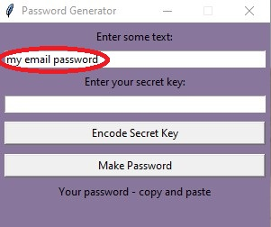
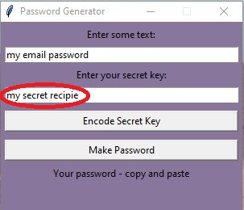
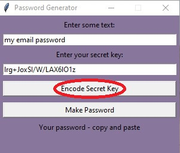
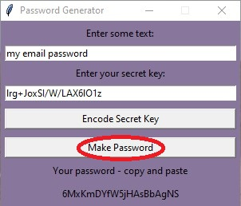

# password-generator
A (hopefully) reasonably secure method to generate repeatable cryptic passwords

Making and (above all) remembering arcane passwords (random sequences of 20 upper and lower case 
letters, numbers, symbols) is always perplexing. Wouldn't be nice if we could use idiosyncratic phrases 
we could remember? That we can turn those into hard passwords, and be able to re-generate them at
anytime?

That's what this application is about. Currently just an experimental Python application, though I plan to in time make an Android version, at least.

## Setup

Simplest: download the .exe in the dist folder.

Or, one can clone and/or fork this repo.

## Use

1) Let's start with a stupidest imaginible 'password' (still not recommended, it's probably better to be more imaginative).

2) Spice it up (technically speaking, we are 'salting' the opriginal phrase). Enter a memorable phrase we can also remember
as your secret key.
Make this part as unique as you can, even if that is the one arcane password you need to write down somewhere.

3) Encode the secret key

4) Make your password

Copy it at the bottom and paste where needed. 

## What it does

Basically, we take memorable (and ideally idiosyncratic) phrases, and turn them into cryptogrpahic hashes (sha256).
Cryptographic hashes are determininate (the same string will always hash the same way), irreversable, and sensitive (in that a single character change in the input yields a very different hash). We then convert that to Base64 encoding, and take the first 20 characters to produce our 20 character alphanumeric password.

Is this the absolute best method? Maybe not. But it should be reasonably difficult to guess one's final password -- as long as your phrases are unique to begin with. And it is easier to remember "my email password" and "my secret recipie" easier for most of us, I think, than to remember "6MxKmDYfW5jHAsBbAgNS."

For real use, be as idiosyncratic with your memorable phrases. This way, even if hackers have this tool to use, to hack your passwords would still require them to hack your brain as well. (And we don't have tech for that... yet. Maybe next month.)

